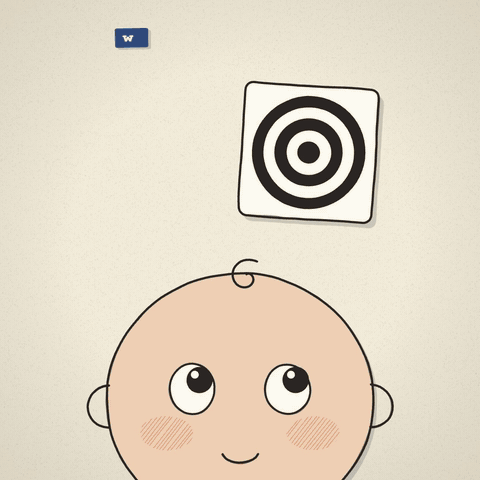
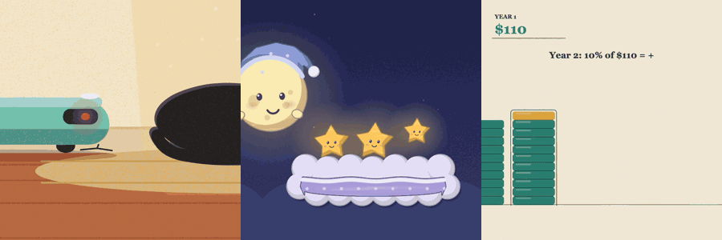

# JavaScript Animation Skills

> Every frame drawn in JavaScript: zero image assets, zero API keys, one HTML file, and the music is synthesized in code too. Agent skills for the kind of animation Claude Opus 5.5 made go around: hand-drawn canvas films, rendered frame-accurately to MP4 and self-checked.



*"I only asked you to fix one line" ([source](./examples/i-only-asked-you-to-fix-one-line)): an agent turns a one-line typo fix into a new city overnight. No images, no fonts to load, no libraries: one 81 KB HTML file, and every note and sound effect is synthesized by the same file with Web Audio. A second example, ["What a newborn sees"](./examples/what-a-newborn-sees), is a 42-second explainer.*

## Gallery: made by an agent from one prompt



Each of these was made by a fresh agent working only from this pack's skill docs and a one-line request, with no human edits: a comedy, a bedtime story for a two-year-old, and a money explainer, each with its own look and its own synthesized soundtrack. [See the gallery](./examples/gallery).

## Install

```bash
npx skills add iart-ai/javascript-animation-skills
```

Or add it as a Claude Code plugin marketplace:

```bash
/plugin marketplace add iart-ai/javascript-animation-skills
```

then `/plugin install javascript-animation-skills`.

The skills run in Claude Code, Cursor, Codex, and 40+ agents. The full agent runs at **[iart.ai](https://iart.ai/?utm_source=github&utm_medium=readme&utm_campaign=javascript-animation-skills&utm_content=funnel)**.

## What's included

| Skill | What it does |
|-------|--------------|
| [javascript-animation](./skills/javascript-animation) | Short animated films computed on an HTML canvas: stories, explainers, loops, picture books from your photos. A drawing library (hand-drawn ink, picture-book illustration, spot-color print, single-line engraving, words as shapes, marker fills), a seek-and-render harness to MP4, contact sheets, and a zero-asset audit. |
| [soundtrack](./skills/soundtrack) | Music written in code with Web Audio, living inside the same page and rendered offline to WAV. Four instrument kits (electro, acoustic, keys, percussion) and several harmonic moods, chosen per piece. A tempo map lands every scene cut on a downbeat, marked by harmony rather than volume. A sync check fails the render if a cut misses the beat or the music jumps loud enough to startle. Also works with AI-generated or your own music. |

## How it works

1. The agent derives a look from the subject (two pieces about different things shouldn't look alike).
2. It writes a **beat grid, a shot list and blocking as data** in the page: tempo, sections (with a break), 10-20 shots on the beat, one continuous world seen through many cameras, and one event list. Pictures, camera and soundtrack all read that data, so sound lands on every action by construction.
3. Every frame is a pure function of time. A headless browser seeks the page into an MP4; the page's Web Audio score (percussion, bass, pads and a synthesized sound for every action) is rendered offline and muxed in.
4. The agent checks its own work before you see it: zero-asset audit, A/V sync (cuts on the beat, no startling jumps), layout (no text colliding with text or sitting on objects), a still per shot against the storyboard, and a director pass on a 2 fps contact sheet for pace, framing, stillness and a grown-up look.

It only asks you something when it can't reasonably guess. Characters, photo-based likenesses and alternative looks are handled only when your piece calls for them.

## When it activates

- "Draw every frame of this in JavaScript" / "make it with no image assets."
- "Make a hand-drawn animated explainer about ..."
- "Turn these photos into an animated story."
- "Make a short animated film / loop on a canvas."
- "Add music made in code" / "sync the music to the cuts."

## Example prompts

- "Make a 40-second hand-drawn explainer on why babies love black-and-white cards. Every frame in code."
- "Animate a short wordless story about a paper boat on its first rainy day, picture-book style, with a music-box soundtrack."
- "Here are photos of my dog. Make a 30-second animated day-in-the-life of her."

## Not the same as

- [generative-illustration-skills](https://github.com/iart-ai/generative-illustration-skills): AI *generates* the illustration parts and code animates them. This pack generates nothing: every mark is code.

## Which model

Built and tested with **Claude Opus 5.5**. Drawing a whole film in code leans hard on the model: spatial reasoning, taste, and long, careful code. The self-check needs a model that can **look at images** (it reviews its own contact sheets and stills).

Other models have not been tested with this pack. Expect cruder drawings from weaker ones. If your agent lets you pick, use the strongest vision-capable model you have.

## Requirements

Node 18+, `npm i playwright-core`, ffmpeg, and Chrome (or `npx playwright install chromium`). No API keys.

## Topics

`javascript-animation` `canvas` `generative-art` `hand-drawn` `web-audio` `zero-assets` `claude-opus` `claude-skill`

## Inspiration

This pack was prompted by public experiments shared by [@kevin_t_ngo](https://x.com/kevin_t_ngo), [@Voxyz_ai](https://x.com/Voxyz_ai), [@liu8in](https://x.com/liu8in) and [@ann_nnng](https://x.com/ann_nnng). No code or assets from their work are included; the techniques here are general ones, and the example is original.

## More packs

Part of the open-source motion skills collection. Full hub: **[github.com/iart-ai/motion-skills](https://github.com/iart-ai/motion-skills)**

## License

MIT

---

Built by **[iart.ai](https://iart.ai/?utm_source=github&utm_medium=readme&utm_campaign=javascript-animation-skills&utm_content=footer)**, the AI motion agent: describe it in a prompt, or point it at a CSV or brand kit, and get editable, on-brand motion graphics with exact text and numbers, one-click edits, and batch export.
